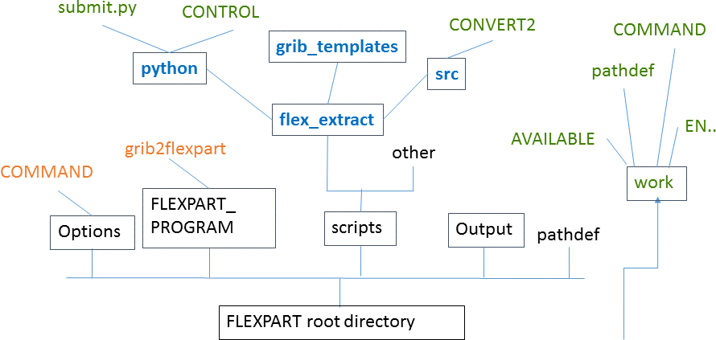

#README

This documentation shows how to install and use the ***flex_extract*** software package to extract ECMWF data and generate the ***FLEXPART*** specific input files. 

Introduction 
=================

To run ***FLEXPART*** with ECMWF data, you first need to retrieve ECMWF GRIB fields and generate ***FLEXPART*** specific input files afterwards. ***FLEXPART*** needs the GRIB data seperated by time so that ***flex_extract*** will combine all data in output files seperated for each time step. The format of these output filenames looks like: `prefixYYMMDDHH`, where prefix can be defined in ***flex_extract*** (usually it should be limited to "2" characters because of further processing reasons).

There are 4 different modes of running ***flex_extract*** :
1. Remote (**): ***flex_extract*** is installed and executed directly on the ECMWF Linux member state server ecgate. Users have to be a registered member-state user.
2. Gateway (**): ***flex_extract*** is installed on a local machine and the scripts are submitted to ECMWF
computer facilities via a member-state gateway server. Users have to be a registered member-state user.
3. Local member state (**): ***flex_extract*** is installed and executed on a local machine. Users have to be a registered member-state user.
4. Local public (***): ***flex_extract*** is installed and executed on a local machine. Users do not have to be a member-state user. A normal registration at the ECMWF website is enough. See also the instruction to install the ECMWF Web API

*(\*\*) To get a ms (member-state) user access, users have to be a resident of a [member state](https://www.ecmwf.int/en/about/who-we-are/member-states) and have to contact their national meteorological center for granting access.*

*(\*\*\*) To get a public user account, the user can just register at the ECMWF website following the instructions [here](https://software.ecmwf.int/wiki/display/WEBAPI/ECMWF+Web+API+Home)!*

For setting up a complete ***FLEXPART*** environment it is recommended to build a directory structure such as:

 

For installation instructions and usage of ***FLEXPART*** please see ***FLEXPART***-Documentation!

Data sets archived at ECMWF
===========================

There are two modes for accessing ECMWF data sets: the **_full access_** and the **_public access_** mode.
A description of these two modes and links to the available data sets is available here: https://www.ecmwf.int/en/forecasts/datasets/archive-datasets

####  Important note for public users

If you want to extract public data sets from the ECMWF servers you first have to register at the ECMWF. Do this by following the instructions at: https://software.ecmwf.int/wiki/display/WEBAPI/Access+MARS

Afterwards you **_need to accept the licenses_** of the data sets you want to extract: 

https://software.ecmwf.int/wiki/display/WEBAPI/Available+ECMWF+Public+Datasets

Now your able to use ***flex_extract*** in public mode (command line parameter "*--public=1*"). 

Installation
===================

### Some important notes for the installation process:
- Use the same compiler and compiler version for all libraries and the fortran program.
- Don't forget to set all library paths to the LD_LIBRARY_PATH variable.
- Don't forget to adapt the makefile for the Fortran program.

### Requirements ###

| Python Support        | Link            | Notes |
| --------------------- |:----------------------:|:-------------------------|
| python                | [http://www.python.org](http://www.python.org)  | We have used [Anaconda python](https://store.continuum.io/cshop/anaconda/) for our testing |
| python-numpy          | [http://www.numpy.org/](http://www.numpy.org/)  | Not necessary if you have installed python Anaconda
| ecmwfapi              | [https://software.ecmwf.int/wiki/display/WEBAPI/ECMWF+Web+API+Home](https://software.ecmwf.int/wiki/display/WEBAPI/ECMWF+Web+API+Home) | You also need to install your API key (as explained in the documentation)

| Utilities             | Link            | Notes |
| --------------------- |:----------------------:|:-------------------------|
|gfortran|[https://gcc.gnu.org/wiki/GFortran](https://gcc.gnu.org/wiki/GFortran)| Make sure that you are using the same compiler version for all libraries in connection with flex_extract, GRIB_API and FLEXPART, otherwise you will have problems.|
|  grib-api or eccodes             | [https://software.ecmwf.int/wiki/display/GRIB/Home](https://software.ecmwf.int/wiki/display/GRIB/Home) / [https://software.ecmwf.int/wiki/display/ECC](https://software.ecmwf.int/wiki/display/ECC) | Make sure you install grib_api/eccodes with JPEG support and python.|
|FFTW|[http://www.fftw.org](http://www.fftw.org)|This is needed by the Emos library, as is mentioned in the installation instructions for Emos|
|  Emos                 | [https://software.ecmwf.int/wiki/display/EMOS/Emoslib](https://software.ecmwf.int/wiki/display/EMOS/Emoslib) | Make sure you carefully read the instructions and have installed the FFTW package before installing Emos.|
| CONVERT2     | |to run prepareFLEXPART.py, you need to compile the Fortran program CONVERT2 (located in the src directory). See separate README file in this directory to get instructions on how to compile this code.|

###  Prepare the environment for using ***flex_extract*** on a local machine

Please follow the instructions on the websites of the libraries. The installation of these libraries can be done by package installation or from scratch, for either case it is useful to consider the official documentation (and also the hints from the ECMWF) rather than trying to explain every detail in here. Nevertheless, we recommend doing the installation in the following order (see links to the libraries in the table above):

1. Read Emoslib installation instructions.
2. Read ECMWF blog about gfortran (https://software.ecmwf.int/wiki/display/SUP/2015/05/11/Building+ECMWF+software+with+gfortran).
3. Install FFTW.
4. Install EMOSLIB (Hint: Apply make 2 times! One time without any options and one time with single precision option.).
5. Install ECCODES OR GRIB_API (for python and fortran). ECCODES is downward compatible with GRIB_API and GRIB_API support will expire at the end of 2018.
6. Register at Mars (see link to ecmwfapi). 
7. Install ECMWF_WEBAPI.
8. Check LD_LIBRARY_PATH environment variable if it contains all paths to the libs. 
9. Check available python packages (e.g. check in python console the commands: import eccodes / import grib_api / import ecmwfapi)
10. Start a simple test retrieval (following the instructions at ECMWF Web API website). 
11. Install ***flex_extract*** (see next section). 

### Installation of ***flex_extract***

To install ***flex_extract*** you have to go to the python directory and call the `install.py` script. It has the following options: 

```
usage: install.py [-h] [--target INSTALL_TARGET] [--makefile MAKEFILE]
                  [--ecuid ECUID] [--ecgid ECGID] [--gateway GATEWAY]
                  [--destination DESTINATION]
                  [--flexpart_root_scripts FLEXPART_ROOT_SCRIPTS]
                  [--job_template JOB_TEMPLATE] [--controlfile CONTROLFILE]

Install flex_extract software locally or on ECMWF machines

optional arguments:
  -h, --help            show this help message and exit
  --target INSTALL_TARGET
                        Valid targets: local | ecgate | cca , the latter two
                        are at ECMWF (default: None)
  --makefile MAKEFILE   Name of Makefile to use for compiling CONVERT2
                        (default: None)
  --ecuid ECUID         user id at ECMWF (default: None)
  --ecgid ECGID         group id at ECMWF (default: None)
  --gateway GATEWAY     name of local gateway server (default: None)
  --destination DESTINATION
                        ecaccess destination, e.g. leo@genericSftp (default:
                        None)
  --flexpart_root_scripts FLEXPART_ROOT_SCRIPTS
                        FLEXPART root directory on ECMWF servers (to find
                        grib2flexpart and COMMAND file) Normally flex_extract
                        resides in the scripts directory of the FLEXPART
                        distribution, thus the: (default: None)
  --job_template JOB_TEMPLATE
                        job template file for submission to ECMWF (default:
                        job.temp.o)
  --controlfile CONTROLFILE
                        file with control parameters (default: CONTROL.temp)
```


#### Local installation of ***flex_extract*** (***flex_extract*** modes 1 (on ECMWF servers), 3 and 4)

---

For a local installation of ***flex_extract*** the user has to adapt the makefile for the Fortran program first. Set the paths to the grib_api or eccodes library and emoslib. Then the installation script should be called as follows:

```
./install.py --target=local --makefile=Makefile.local.gfortan
```

where the makefile name can differ if the user prepared another makefile for his environment. 
On ECMWF servers a makefile named "Makefile.gfortran" is already provided in the "src"-directory. It is also the default makefile, so that the parameter does not have to be set when calling "install.py".

If the ***flex_extract*** is to be installed within a ***FLEXPART*** environment it should be called with the parameter `flexpart_root_scripts` to let ***flex_extract*** know about the path to ***FLEXPART***.

The installation was successful if the compilation of the Fortran program ``CONVERT2`` didn't fail and is displayed in the terminal. 

#### Installation using a gateway server (***flex_extract*** mode 2 only)

---

If the user has a gateway server and the Ecaccess toolkit available, ***flex_extract*** can be installed such that it is executed on the local machine and a job script is submitted to the ECMWF server. The final ***FLEXPART*** input files are then send back via the Ecaccess command line tool "ectrans". To use this tool, the user has to create an association directly on the local gateway server via the localhost ecaccess.ecmwf.int and provide the association name as the "destination"-parameter when calling "install.py". 

The gateway server has to be registered at ECMWF. For information about a gateway server see: 
- https://software.ecmwf.int/wiki/display/ECAC/Releases+-+Gateway+package
- and the Software Installation Plan (SIP.pdf) in the docs/ directory.

Afterwards ***flex_extract*** can be installed with the following command:
```
./install.py --target=local --makefile=Makefile.gfortan --ecuid=<id> --ecgid=<gid> --gateway=<servername> --destination=<destinationname>
```

If the installation was successful the user gets an email with a success note!


Using ***flex_extract***
===================

This section provides the absolut basics on how ***flex_extract*** is to be used. For more information about possible settings, performance, parameter combinations and so one, the user is referred to the SIP.pdf and SUT.pdf documents and the www.flexpart.eu community website. It is also possible to ask for help by writing to the ***FLEXPART*** user email list (registration needed) or by creating a ticket on the community website.

#### CONTROL file 

***flex_extract*** is controlled by providing "CONTROL"-files with a list of parameter settings. These parameter are described in detail in the *Software User Tutorial (SUT.pdf)*. 
The "CONTROL"-files specifies which ECMWF data set is to be retrieved, the time and spatial resolution, the format of the grib file and many more. In the `python` directory are some example `CONTROL` files for the different data sets and access modes which can be retrieved with ***flex_extract***:

```
CONTROL_CERA
CONTROL_CV
CONTROL_EA5.public
CONTROL_FC.pure
CONTROL_OD.highres.gauss
CONTROL_CERA.public
CONTROL_EA5
CONTROL_EI.global
CONTROL_FC.twiceaday
CONTROL_OPS.4V
CONTROL_CF
CONTROL_EA5.highres
CONTROL_EI.public
CONTROL_OD.highres.eta
CONTROL.temp
```

For information about all the possible parameter settings and explanation, please see the SUT.pdf document in the `docs/` directory.

`CONTROL`-files with a `.public` ending is usable for the public access mode. The main difference is the parameter ``dataset`` which explicitly specifies the public data sets. Additionally, not all meteorological fields and times were archived in the public data sets and are considered in the public `CONTROL`-files.

#### Python scripts 

* `submit.py`

This is the main program for doing both, retrieving ECMWF data and generating the ***FLEXPART*** input files. It combines the two sub-programs `getMARSdata.py` and `prepareFLEXPART.py` which can also be run by themselves for debugging purposes.
Use the `-h` option to get the parameter options:

```
usage: submit.py [-h] [--start_date START_DATE] [--end_date END_DATE]
                 [--date_chunk DATE_CHUNK] [--basetime BASETIME] [--step STEP]
                 [--levelist LEVELIST] [--area AREA] [--inputdir INPUTDIR]
                 [--outputdir OUTPUTDIR]
                 [--flexpart_root_scripts FLEXPART_ROOT_SCRIPTS] [--ppid PPID]
                 [--job_template JOB_TEMPLATE] [--queue QUEUE]
                 [--controlfile CONTROLFILE] [--debug DEBUG] [--public PUBLIC]

Retrieve FLEXPART input from ECMWF MARS archive

optional arguments:
  -h, --help            show this help message and exit
  --start_date START_DATE
                        start date YYYYMMDD (default: None)
  --end_date END_DATE   end_date YYYYMMDD (default: None)
  --date_chunk DATE_CHUNK
                        # of days to be retrieved at once (default: None)
  --basetime BASETIME   base such as 00/12 (for half day retrievals) (default:
                        None)
  --step STEP           steps such as 00/to/48 (default: None)
  --levelist LEVELIST   Vertical levels to be retrieved, e.g. 30/to/60
                        (default: None)
  --area AREA           area defined as north/west/south/east (default: None)
  --inputdir INPUTDIR   root directory for storing intermediate files
                        (default: None)
  --outputdir OUTPUTDIR
                        root directory for storing output files (default:
                        None)
  --flexpart_root_scripts FLEXPART_ROOT_SCRIPTS
                        FLEXPART root directory (to find grib2flexpart and
                        COMMAND file) Normally flex_extract resides in the
                        scripts directory of the FLEXPART distribution
                        (default: None)
  --ppid PPID           Specify parent process id for rerun of prepareFLEXPART
                        (default: None)
  --job_template JOB_TEMPLATE
                        job template file for submission to ECMWF (default:
                        job.temp)
  --queue QUEUE         queue for submission to ECMWF (e.g. ecgate or cca )
                        (default: None)
  --controlfile CONTROLFILE
                        file with control parameters (default: CONTROL.temp)
  --debug DEBUG         Debug mode - leave temporary files intact (default: 0)
  --public PUBLIC       Public mode - retrieves the public datasets (default:
                        0)
```

*Optional arguments are listed in squared brackets.*


* `getMARSdata.py`

This program retrieves the ECMWF data from ECMWF servers using [ECMWF WebApi](https://software.ecmwf.int/wiki/display/WEBAPI/ECMWF+Web+API+Home) or [Mars](https://software.ecmwf.int/wiki/display/UDOC/MARS+user+documentation), depending on your user status and your selection of the running mode. It requires the `ECMWF WebApi` python library (see Requirements below). Check with your local IT group as it may be already available.


* `prepareFLEXPART.py`

This program generates FLEXPART input files from the retrieved meteorological fields. It requires python interface to grib_api or eccodes and the Fortran program `CONVERT2` (located in `src` directory). `CONVERT2` needs a namelist which is generated from the python program.

#### execute flex_extract locally (member-state user)

Almost every command line parameter for the `submit.py` script call has a default value or is read from the specified `CONTROL` file. 
Therefore, for a local extraction of ERA-Interim data as a member-state user the script can be called simply by passing a `CONTROL` file and a starting date with the following command:
```
./submit.py --controlfile=CONTROL_EI.global --start_date=20101201
```
If there was just a starting date without an end date, ***flex_extract*** retrieves just this one day of meteorological data. The `CONTROL_EI.global` file has a set of default values which needs to be adjusted regarding users needs. It is also possible to set the dates within the `CONTROL`-file instead of passing it via command line parameter. 


#### execute flex_extract locally (public user)

As a public user one has to use the `CONTROL` file with the `.public` extension and the parameter `public`:
```
./submit.py --controlfile=CONTROL_EI.public --start_date=20101201 --public=1
```
Otherwise, except of the different data available, the usage of ***flex_extract*** is the same as for member-state users.

#### execute flex_extract via gateway server

If ***flex_extract*** was installed via a gateway server and a file "*ECMWF_ENV*" is available in the ``python``-directory, the ``submit.py`` script can be called with the `--queue` option. A job script is then prepared and submitted to the ECMWF server (in this case, "ecgate") .

```
./submit.py --queue=ecgate --controlfile=CONTROL_EI.global --start_date=20101201
```

The job status can then be checked by typing:
````
ecaccess-job-list
```` 

If the parameters *ecuid*, *ecgid*, *gateway* and *destination* were set correctly during installation and the gateway server is running, the resulting ***FLEXPART*** input files can be directly transferred to the local gateway by setting the paramter ``ectrans`` in the ``CONTROL``-file to ``1``.

Regardless of the job being successful or not, the user will receive an email with the log messages. 

#  Installation FAQ 


